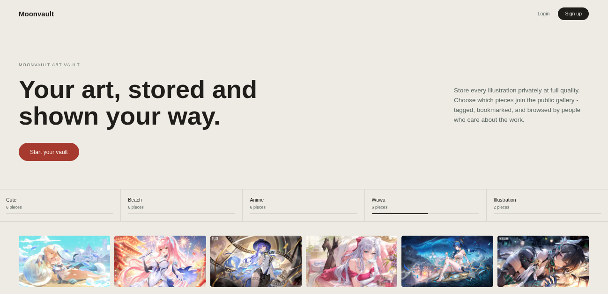
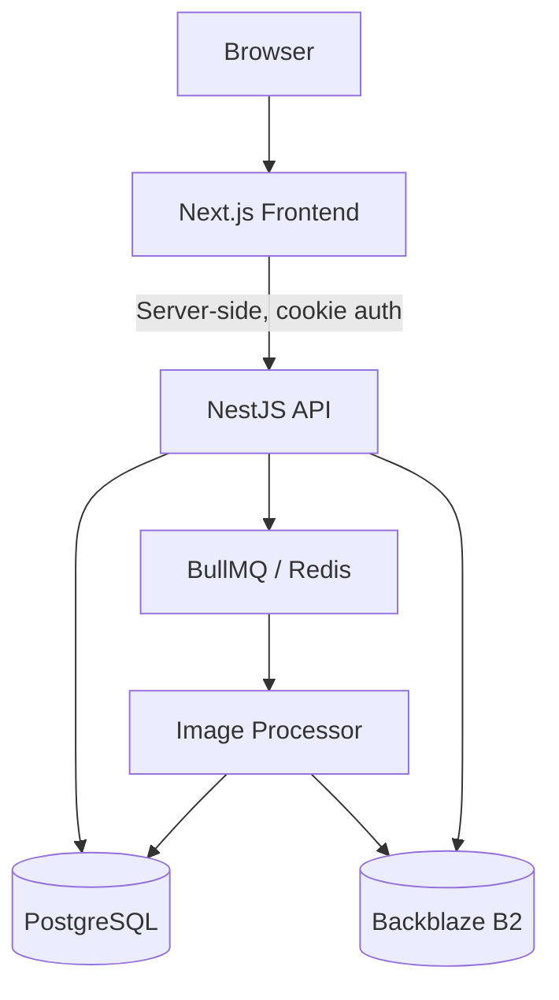

# Moonvault

**A personal art vault with a Pixiv-style public gallery.**

Store your illustrations privately, at full quality and true aspect ratio, and choose which pieces to share on a public, browsable gallery — complete with tags, bookmarks, rankings, and artist profiles.

[](https://github.com/zephyrkaidren/moonvault/actions/workflows/ci.yml)
[](./LICENSE)


---

## Screenshot



_I will attach a short showcase video later when I finish this project_

---

## About

Moonvault is a full-stack media platform combining two things that don't usually live in the same product: a private, quota-managed personal storage system (like Dropbox) and a public, social art gallery (like Pixiv or Pinterest). Every upload goes through an asynchronous processing pipeline - thumbnail generation, EXIF extraction, and perceptual-hash duplicate detection - before it's ever shown anywhere.

This project was built end-to-end as a solo full-stack engineering exercise, with a deliberate emphasis on real backend systems work (storage abstraction, async job processing, quota enforcement, rate limiting) rather than a purely CRUD-driven app.

## Tech stack

| Layer | Technology |
|---|---|
| Frontend | Next.js (App Router), TypeScript, Tailwind CSS |
| Backend | NestJS, TypeScript |
| Database | PostgreSQL via Prisma (driver adapters) |
| Queue / Jobs | BullMQ + Redis |
| Image processing | `sharp`, `exifr`, `sharp-phash` |
| Object storage | Backblaze B2 (S3-compatible), behind a swappable provider interface |
| Email | Swappable provider interface (local SMTP for dev, easily pointed at a real provider) |
| CI/CD | GitHub Actions (lint, build, test on every PR) |

## Architecture



The frontend never talks to the backend directly from client-side JavaScript - every authenticated request is proxied through a Next.js Route Handler running server-side, which attaches the JWT from an httpOnly cookie. This keeps the auth token completely inaccessible to browser JavaScript.

## Project structure

```
moonvault/
├── apps/
│   ├── api/          # NestJS backend
│   └── web/          # Next.js frontend
├── packages/
│   └── shared/       # Shared types/utilities (reserved)
├── docker-compose.dev.yml
└── Makefile           # Local dev container management
```

## Getting started

**Prerequisites:** Node.js 22+, pnpm, Docker.

```bash
git clone https://github.com/zephyrkaidren/moonvault.git
cd moonvault
pnpm install
```

Start the local dependencies (PostgreSQL, Redis, Mailhog for email testing):

```bash
make db-up
```

Set up environment variables - copy each `.env.example` to `.env` in both `apps/api` and `apps/web`, and fill in the values (storage credentials, JWT secret, etc.).

Run database migrations:

```bash
cd apps/api
pnpm dlx prisma migrate dev
```

Run both apps (in separate terminals):

```bash
# API
cd apps/api && pnpm run start:dev

# Frontend
cd apps/web && pnpm run dev
```

Run the full check suite (lint, build, test) from the repo root:

```bash
pnpm run lint
pnpm run build
pnpm run test
```

## Features

**Storage & media pipeline**
- Per-user storage quotas, enforced against actual uploaded byte counts
- Provider-agnostic storage abstraction (`StorageProvider` interface) - swap the backing storage service without touching any application code. Currently backed by Backblaze B2 (S3-compatible), with a local-disk implementation for development
- Asynchronous processing via BullMQ: thumbnail generation (`sharp`), EXIF metadata extraction (GPS data deliberately never parsed), and perceptual-hash duplicate detection
- Signed, time-limited object URLs with server-side caching for efficient, cache-friendly delivery

**Public gallery**
- Cursor-paginated public feed, filterable by tag and image orientation
- Time-windowed ranking page (daily / weekly / monthly), ranked by bookmarks
- Artist profile pages with public stats
- Bookmarking, tagging, and per-image visibility control (public/private)

**Accounts & security**
- JWT-based authentication with httpOnly cookie storage (auth handled server-side via Next.js Route Handlers, never exposed to client-side JavaScript)
- Username + email registration, generic login-failure messaging to prevent account enumeration
- Full forgot-password / reset-password flow with expiring, single-use tokens, delivered via a swappable email-provider abstraction
- Per-route rate limiting on authentication and upload endpoints
- Editable profile (display name, password) with real ownership checks throughout

## Roadmap

- [x] Auth, quota system, and storage abstraction
- [x] Upload, processing pipeline (thumbnails, EXIF, duplicate detection)
- [x] Public gallery, bookmarks, tags, ranking, artist profiles
- [x] Frontend: auth pages, dashboard, gallery, artist profiles
- [x] Production storage backend (Backblaze B2)
- [x] Auth hardening: password reset, rate limiting
- [ ] Automated frontend test coverage
- [ ] Deployment

## License

MIT - see [LICENSE](./LICENSE).
